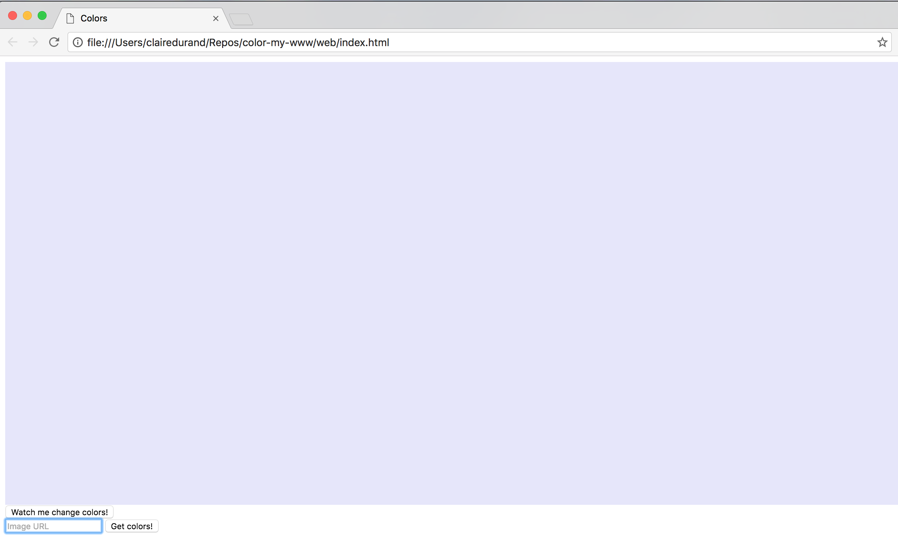
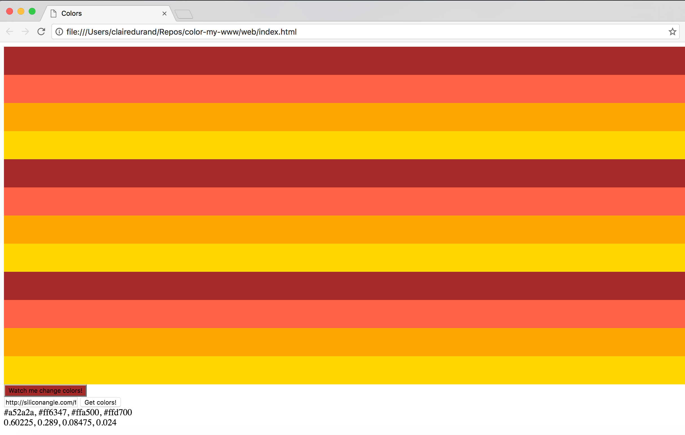

# color-my-www
Implements the [Clarifai](https://www.clarifai.com/) API to color website elements based on an image

## How to
1. Create an account at [developer.clarifai.com](https://developer.clarifai.com/).

2. Create an application and copy and paste your application CLIENT_ID and CLIENT_SECRET into a `keys.js` file as shown below. (Don't forget to include it in your `.gitignore` file so that you don't share your credentials with everyone!)

	```
	var CLIENT_ID = 'your ID here';
	var CLIENT_SECRET = 'your secret here';
	```

	The `getCredentials()` will generate an access token so that you don't have to worry about it!


3. Include clarifai.js in your project source.

4. In your index.html, create an array of the elements whose color you want dependent on image uploaded. Pass the image url and the element array to the `requestColor` function (it lives in `clarifai.js`) and call it.


## Example Usage
I created `index.html` as a usage example if you want to check that out! Enter an image url in the input box, and click the `Get colors` button. The colors of the divs and button above the input will change according to the colors most frequent in the input image. The hex values for the colors and their probabilities are printed underneath the input box.


This is the webpage before input


This is the input image (http://siliconangle.com/files/2016/03/Sunset-1080x675.jpg)


This is the webage after the colors have been replaced


## Sources
I definitely stole the clarifai javascript started from [Cassidy's clarifai javascript starter](https://github.com/cassidoo/clarifai-javascript-starter). Check it out, it's p cool.
